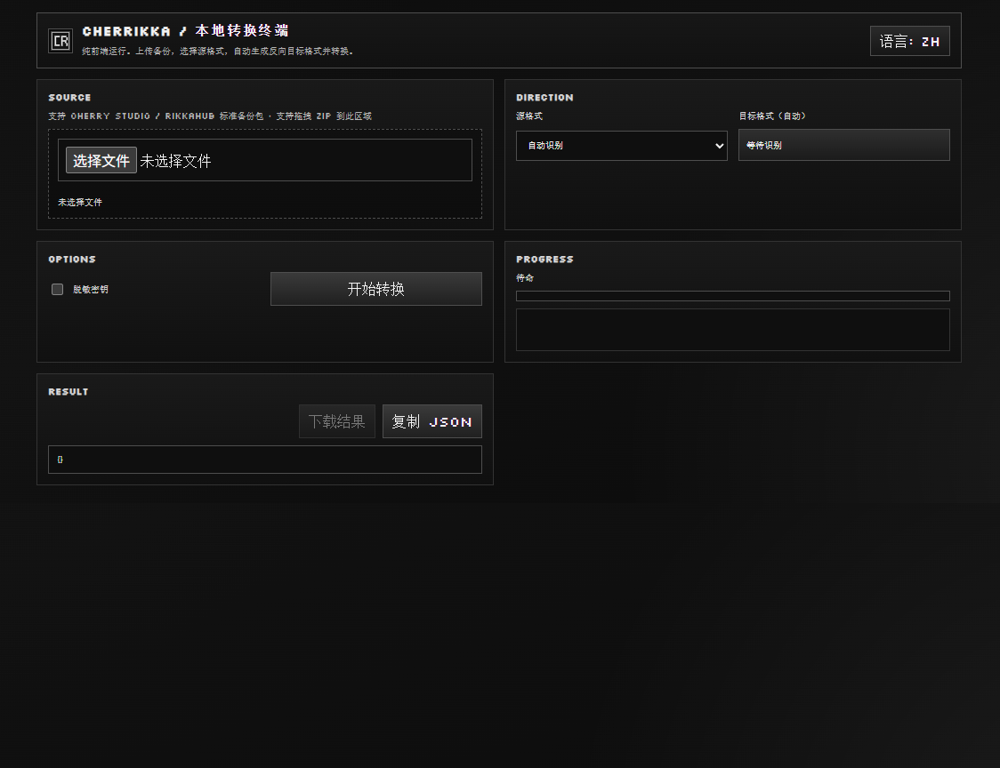

<div align="center">
  
  <h1>Cherrikka</h1>
  <p><strong>Cherry Studio ↔ RikkaHub 备份互转工具（CLI + 纯前端）</strong></p>
  <p>
    <a href="https://uwp.de5.net"><strong>在线试用（uwp.de5.net）</strong></a>
  </p>
</div>

<div align="center">
  
  <p><sub>前端页面（纯浏览器本地转换）</sub></p>
</div>

## 项目简介

Cherrikka 用于在 `Cherry Studio` 与 `RikkaHub` 的备份 ZIP 之间互转。  
支持两种方式：

1. `Web 前端`：浏览器本地转换，零后端依赖。
2. `CLI`：适合批量、自动化和脚本场景。

## 核心特性

1. 双向转换：`Cherry -> Rikka`、`Rikka -> Cherry`。
2. 纯前端可用：可直接部署静态站并在线转换。
3. CLI 稳定链路：支持 `inspect / validate / convert / serve`。
4. Sidecar 保真：输出包含 `cherrikka/manifest.json` 与 `cherrikka/raw/source.zip`。

## 前端使用（推荐）

### 在线直接使用

1. 打开 [https://uwp.de5.net](https://uwp.de5.net)
2. 上传备份 ZIP
3. 选择源格式（`auto/cherry/rikka`）
4. 点击 `Convert`
5. 下载转换结果

### 本地运行前端

```bash
cd frontend
npm install
npm run dev
```

默认地址：`http://localhost:5173`（以终端输出为准）。

### 前端构建

```bash
cd frontend
npm run build
```

构建输出目录：`frontend/dist`

## CLI 使用

### 环境要求

1. Go `1.23+`
2. 在仓库根目录执行命令

### 快速开始

```bash
go build -o cherrikka ./cmd/cherrikka
./cherrikka convert --input <src.zip> --output <dst.zip> --from auto --to rikka
```

### 命令总览

| 命令 | 作用 |
| --- | --- |
| `inspect` | 识别备份格式并输出摘要 |
| `validate` | 校验备份结构与引用一致性 |
| `convert` | 执行格式转换 |
| `serve` | 启动本地 Web 服务（Go 版） |

### 常用命令

1. 识别格式

```bash
./cherrikka inspect --input <backup.zip>
```

2. 校验结构

```bash
./cherrikka validate --input <backup.zip>
```

3. 执行转换

```bash
./cherrikka convert \
  --input <src.zip> \
  --output <dst.zip> \
  --from auto|cherry|rikka \
  --to cherry|rikka \
  [--template <target-template.zip>] \
  [--redact-secrets]
```

参数说明：

| 参数 | 说明 |
| --- | --- |
| `--from` | 源格式，推荐 `auto` |
| `--to` | 目标格式：`cherry` 或 `rikka` |
| `--template` | 可选，提供目标端模板包 |
| `--redact-secrets` | 可选，脱敏密钥后输出 |

## 常见问题

1. 导入后会话数量不对：先用 `inspect/validate` 检查输入包是否包含对应会话。
2. 模型可见但空回复：优先检查 provider `baseUrl` 与模型映射是否可回查。
3. 大文件转换慢：建议优先使用 CLI，或在前端模式下关闭其他高占用程序。

## 文档

1. 前端对齐进展：`docs/frontend-rewrite-parity.md`
2. 技术实现说明：`docs/technical-implementation.md`
